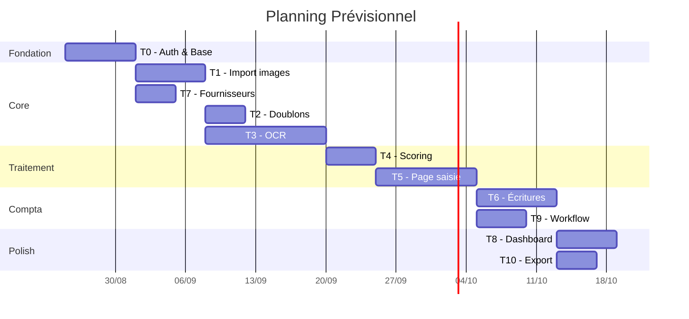
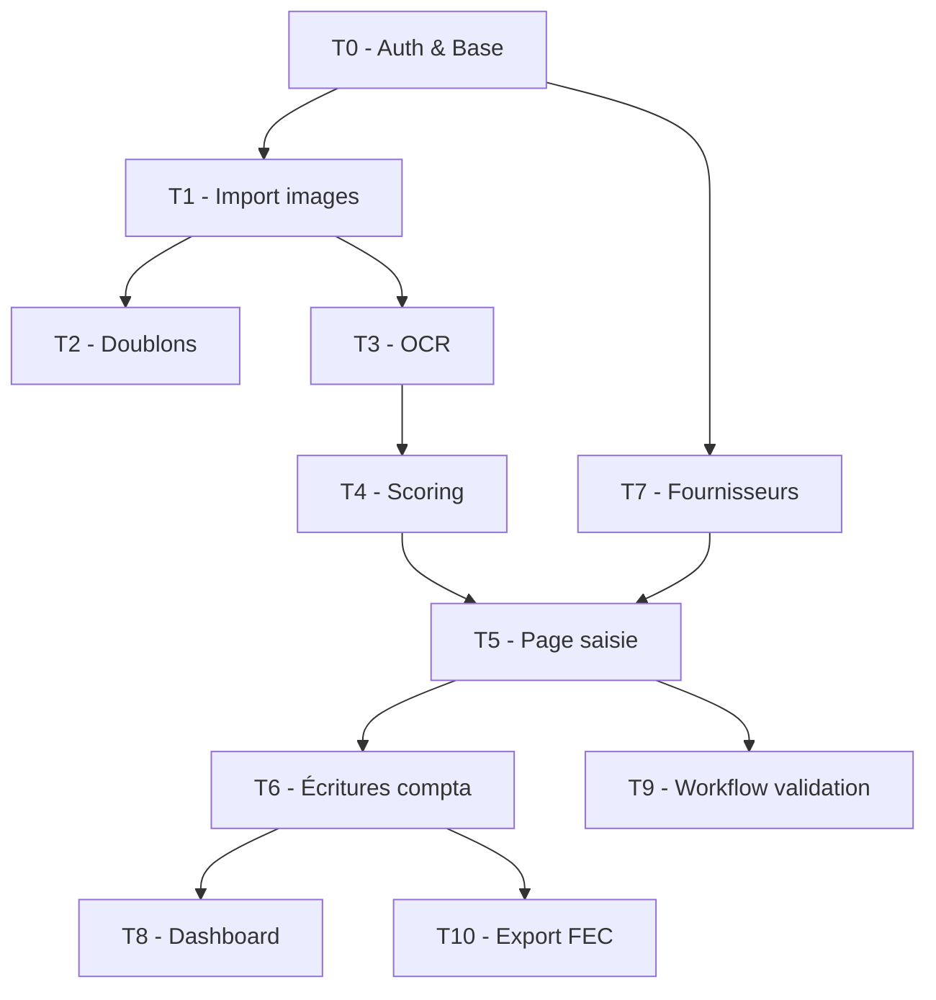

# 📋 Découpage des Tâches — Module Pré-Comptabilité (MCA)

> [!NOTE]
> Chaque tâche est conçue pour être **assignable individuellement** à un membre de l'équipe.
> Les fonctionnalités additionnelles (T7-T10) sont des suggestions pour un produit complet.

---

## 📊 Vue d'ensemble

| # | Tâche | Priorité | Complexité | Estimation |
|---|-------|----------|------------|------------|
| T0 | Auth & Base | 🔴 Critique | ⭐⭐⭐ | 5-7j |
| T1 | Import image en masse | 🔴 Critique | ⭐⭐⭐ | 5-7j |
| T2 | Détection des doublons | 🟠 Haute | ⭐⭐ | 3-4j |
| T3 | Implémentation OCR | 🔴 Critique | ⭐⭐⭐⭐⭐ | 8-12j |
| T4 | Score de traitement | 🟠 Haute | ⭐⭐⭐ | 4-5j |
| T5 | Page de saisie | 🔴 Critique | ⭐⭐⭐⭐ | 7-10j |
| T6 | Écriture comptable | 🔴 Critique | ⭐⭐⭐⭐ | 6-8j |
| T7 | Gestion fournisseurs | 🟠 Haute | ⭐⭐ | 3-4j |
| T8 | Dashboard & Reporting | 🟡 Moyenne | ⭐⭐⭐ | 5-6j |
| T9 | Workflow validation | 🟡 Moyenne | ⭐⭐⭐ | 4-5j |
| T10 | Export FEC & Archivage | 🟡 Moyenne | ⭐⭐ | 3-4j |



---

## Dépendances



---

## T0 — 🔐 Authentification & Configuration de Base

**Assignable à :** Développeur Backend Senior

**Description :** Mettre en place l'infrastructure de base : authentification, gestion multi-entreprise, et seed du plan comptable.

### Sous-tâches

| # | Sous-tâche | Détail |
|---|-----------|--------|
| T0.1 | Créer le schéma de base | Tables `users`, `roles`, `user_roles`, `sessions`, `companies`, `user_companies`, `fiscal_years`, `audit_logs` |
| T0.2 | API inscription / connexion | Endpoint register, login, refresh token, logout |
| T0.3 | Middleware d'authentification | JWT validation, extraction user, rate limiting |
| T0.4 | Gestion des rôles | CRUD rôles, assignation, middleware de permissions |
| T0.5 | Multi-entreprise | Sélection d'entreprise active, isolation des données |
| T0.6 | Seed plan comptable | Import PCG (Plan Comptable Général) par défaut, tables `chart_of_accounts`, `journals`, `tax_rates` |
| T0.7 | Page login / register UI | Interface de connexion moderne et responsive |

### Critères d'acceptation
- [ ] Un utilisateur peut s'inscrire, se connecter, se déconnecter
- [ ] Les tokens JWT expirent et se rafraîchissent correctement
- [ ] Les rôles limitent l'accès aux endpoints protégés
- [ ] Un utilisateur peut appartenir à plusieurs entreprises
- [ ] Le plan comptable par défaut est injecté à la création d'entreprise
- [ ] Toutes les actions sont tracées dans `audit_logs`

---

## T1 — 📷 Import Image en Masse

**Assignable à :** Développeur Full-Stack

**Description :** Permettre l'upload de multiples images/PDF de factures en une seule fois, avec gestion de lots et prévisualisation.

### Sous-tâches

| # | Sous-tâche | Détail |
|---|-----------|--------|
| T1.1 | API upload multiple | Endpoint POST multipart, validation MIME (jpg, png, pdf), limite de taille |
| T1.2 | Stockage fichiers | Système de stockage (local ou S3), organisation par company/année/mois |
| T1.3 | Gestion des lots | Création automatique de `document_batches`, suivi progression |
| T1.4 | Calcul hash SHA-256 | Hash de chaque fichier pour la détection doublons ultérieure |
| T1.5 | UI Drag & Drop | Zone de drop, barre de progression, prévisualisation miniatures |
| T1.6 | Gestion erreurs | Fichiers corrompus, trop volumineux, format non supporté |
| T1.7 | Historique imports | Liste des lots avec statut, filtres, pagination |

### Critères d'acceptation
- [ ] Upload de 50+ fichiers simultanés sans crash
- [ ] Barre de progression par fichier et globale
- [ ] Les fichiers sont stockés de manière organisée
- [ ] Le hash SHA-256 est calculé pour chaque fichier
- [ ] Les formats non supportés sont rejetés avec message clair
- [ ] Un lot (batch) est créé automatiquement avec compteurs

> [!TIP]
> Prévoir un **worker/queue** (ex: Bull, RabbitMQ) pour le traitement asynchrone des fichiers importés.

---

## T2 — 🔍 Détection des Doublons

**Assignable à :** Développeur Backend

**Description :** Détecter automatiquement les factures en double selon plusieurs critères (hash, n° facture, montant+date).

### Sous-tâches

| # | Sous-tâche | Détail |
|---|-----------|--------|
| T2.1 | Détection par hash exact | Comparer `file_hash` pour détecter les fichiers identiques |
| T2.2 | Détection par n° facture | Après OCR : même fournisseur + même n° facture |
| T2.3 | Détection par montant+date | Même fournisseur + même montant + même date (±3 jours) |
| T2.4 | Détection fuzzy | Similarité de contenu OCR (distance de Levenshtein, >85%) |
| T2.5 | Groupes de doublons | Créer `duplicate_groups` et `duplicate_group_items` |
| T2.6 | UI résolution | Interface pour comparer visuellement les doublons côte à côte |
| T2.7 | Actions | Marquer comme original, ignorer, supprimer le doublon |

### Critères d'acceptation
- [ ] Doublons exacts (même fichier) détectés à l'import
- [ ] Doublons sémantiques détectés après OCR
- [ ] Interface de comparaison côte à côte
- [ ] L'utilisateur peut résoudre chaque groupe (garder/supprimer)
- [ ] Un document résolu ne remonte plus comme doublon

---

## T3 — 🤖 Implémentation OCR & Classification

**Assignable à :** Développeur Backend / ML

**Description :** Extraire automatiquement les données des factures via OCR et classifier le type de document.

### Sous-tâches

| # | Sous-tâche | Détail |
|---|-----------|--------|
| T3.1 | Intégration moteur OCR | Connecteur pour Google Vision / Azure Document AI / Tesseract |
| T3.2 | Pré-traitement image | Rotation, détramage, amélioration contraste, redressement |
| T3.3 | Extraction champs clés | Fournisseur, n° facture, date, montants HT/TVA/TTC |
| T3.4 | Extraction lignes | Tableau des lignes de facture (description, qté, prix) |
| T3.5 | Classification type | Facture / Avoir / Reçu / Autre — via règles + ML |
| T3.6 | Matching fournisseur | Associer automatiquement au fournisseur existant (fuzzy match) |
| T3.7 | Suggestion compte comptable | Proposer le compte basé sur historique + catégorie |
| T3.8 | Stockage résultats | Sauvegarder dans `ocr_results` avec scores de confiance |
| T3.9 | Système de queue | Traitement asynchrone via workers (batch processing) |
| T3.10 | Gestion fallback | Si un provider échoue, tenter le suivant |

### Critères d'acceptation
- [ ] Taux d'extraction > 80% sur les champs clés (fournisseur, montant, date)
- [ ] Classification correcte du type de document > 90%
- [ ] Score de confiance par champ extrait
- [ ] Traitement asynchrone sans bloquer l'UI
- [ ] Fallback si le provider principal est indisponible
- [ ] Temps de traitement < 10s par document

> [!WARNING]
> L'OCR est la tâche la plus **complexe et critique**. Prévoir des itérations et un jeu de test conséquent.

---

## T4 — 📊 Score de Traitement (0-100)

**Assignable à :** Développeur Backend

**Description :** Calculer un score de confiance pour chaque facture importée. Score < 50 = à traiter manuellement, Score ≥ 50 = pré-traitée.

### Sous-tâches

| # | Sous-tâche | Détail |
|---|-----------|--------|
| T4.1 | Définir la matrice de scoring | Pondération par champ (voir ci-dessous) |
| T4.2 | Calcul automatique | Calculer le score après OCR, stocker dans `documents.processing_score` |
| T4.3 | Détail du score | Stocker le détail par champ dans `documents.score_details` (JSONB) |
| T4.4 | Seuil configurable | Paramètre par entreprise dans `companies.settings` |
| T4.5 | Tri & filtrage | API + UI pour trier les documents par score |
| T4.6 | Badge visuel | Indicateur couleur (rouge < 30, orange 30-50, vert > 50) |
| T4.7 | Recalcul | Recalculer le score après correction manuelle |

### Matrice de Scoring Suggérée

| Champ | Poids | Critère pour score max |
|-------|-------|----------------------|
| Fournisseur détecté | 20 pts | Match exact avec fournisseur existant |
| N° facture | 15 pts | Détecté et non doublon |
| Date facture | 15 pts | Format date valide détecté |
| Montant TTC | 20 pts | Nombre valide extrait |
| Lignes de facture | 15 pts | Au moins 1 ligne extraite |
| Qualité image | 10 pts | Résolution et clarté suffisantes |
| Type document | 5 pts | Classification avec confiance > 80% |

### Critères d'acceptation
- [ ] Score calculé automatiquement après chaque OCR
- [ ] Le détail du score est consultable par champ
- [ ] Les factures sont triées par score dans l'interface
- [ ] Le seuil (50 par défaut) est configurable par entreprise
- [ ] Badge couleur visible sur chaque document

---

## T5 — ✍️ Page de Saisie (Pré-saisie des Factures)

**Assignable à :** Développeur Frontend Senior

**Description :** Interface de saisie/correction des factures avec pré-remplissage OCR, vue document côte à côte, et validation.

### Sous-tâches

| # | Sous-tâche | Détail |
|---|-----------|--------|
| T5.1 | Layout split-screen | Document (image/PDF) à gauche, formulaire à droite |
| T5.2 | Formulaire facture | Champs : fournisseur, n° facture, date, type, devise |
| T5.3 | Tableau lignes | Lignes de facture éditables (description, compte, qté, prix, TVA) |
| T5.4 | Pré-remplissage OCR | Remplir auto les champs depuis `ocr_results.structured_data` |
| T5.5 | Indicateurs de confiance | Highlight des champs à faible confiance OCR |
| T5.6 | Autocomplete fournisseur | Recherche fournisseur existant, création rapide si nouveau |
| T5.7 | Autocomplete compte | Recherche dans le plan comptable avec filtre |
| T5.8 | Calculs automatiques | HT × TVA = TTC, total des lignes, vérification cohérence |
| T5.9 | Navigation documents | Boutons précédent/suivant pour traiter en lot |
| T5.10 | Sauvegarde & statut | Brouillon, à valider, validé — avec tracking corrections |
| T5.11 | Raccourcis clavier | Tab pour naviguer, Ctrl+S pour sauvegarder, etc. |
| T5.12 | Zoom & rotation | Outils de manipulation du document source |

### Critères d'acceptation
- [ ] Le formulaire est pré-rempli par les données OCR
- [ ] Les champs à faible confiance sont mis en évidence
- [ ] L'utilisateur peut corriger tous les champs
- [ ] Le total se recalcule automatiquement
- [ ] Navigation rapide entre documents du même lot
- [ ] Le document source est visible en permanence à côté du formulaire
- [ ] Les corrections sont enregistrées (pour amélioration future de l'OCR)

> [!IMPORTANT]
> C'est la page **la plus utilisée** du module. L'ergonomie et la rapidité de saisie sont essentielles.

---

## T6 — 📒 Écriture Comptable des Saisies

**Assignable à :** Développeur Backend (profil comptable)

**Description :** Générer automatiquement les écritures comptables à partir des factures validées.

### Sous-tâches

| # | Sous-tâche | Détail |
|---|-----------|--------|
| T6.1 | Règles de génération | Mapping facture → écriture (débit/crédit par type) |
| T6.2 | Génération auto | Créer `journal_entries` + `journal_entry_lines` depuis une facture validée |
| T6.3 | Numérotation | Numéro séquentiel par journal et exercice |
| T6.4 | Vérification équilibre | Contrôle débit = crédit avant validation |
| T6.5 | Écriture achat type | Débit compte charge + TVA déductible, Crédit fournisseur |
| T6.6 | Écriture avoir | Contre-passation de l'écriture initiale |
| T6.7 | Génération en masse | Comptabiliser un lot de factures validées |
| T6.8 | Prévisualisation | Voir l'écriture avant comptabilisation |
| T6.9 | Contre-passation | Annuler une écriture comptabilisée (écriture inverse) |
| T6.10 | Grand livre | Vue par compte avec solde progressif |
| T6.11 | Balance générale | Totaux débit/crédit/solde par compte |

### Exemple d'écriture — Facture achat

```
Journal: AC (Achats) — Date: 18/08/2026
N° Écriture: AC-2026-00042
Réf: FAC-2026-001 (Fournisseur X)
┌──────────────────┬──────────┬──────────┬──────────┐
│ Compte           │ Libellé  │ Débit    │ Crédit   │
├──────────────────┼──────────┼──────────┼──────────┤
│ 601000           │ Achats   │ 150 000  │          │
│ 445660           │ TVA déd. │  30 000  │          │
│ 401000           │ Fourn. X │          │ 180 000  │
├──────────────────┼──────────┼──────────┼──────────┤
│ TOTAL            │          │ 180 000  │ 180 000  │
└──────────────────┴──────────┴──────────┴──────────┘
```

### Critères d'acceptation
- [ ] Une écriture équilibrée est générée par facture validée
- [ ] La numérotation est séquentielle et sans trou
- [ ] L'écriture peut être prévisualisée avant comptabilisation
- [ ] La contre-passation crée une écriture inverse
- [ ] Le grand livre et la balance sont consultables
- [ ] Impossible de modifier une écriture comptabilisée (immuabilité)

---

## T7 — 👥 Gestion des Fournisseurs *(Additionnelle)*

**Assignable à :** Développeur Full-Stack

**Description :** CRUD complet des fournisseurs avec association automatique aux factures.

### Sous-tâches

| # | Sous-tâche | Détail |
|---|-----------|--------|
| T7.1 | CRUD fournisseur | Création, lecture, modification, suppression (soft delete) |
| T7.2 | Fiche fournisseur | Infos, compte comptable par défaut, conditions de paiement |
| T7.3 | Création rapide | Depuis la page de saisie (modal) |
| T7.4 | Historique factures | Liste des factures par fournisseur |
| T7.5 | Import CSV | Import en masse de la liste fournisseurs |
| T7.6 | Auto-matching | Suggestion fournisseur basée sur le nom OCR |

### Critères d'acceptation
- [ ] CRUD fonctionnel avec recherche et pagination
- [ ] Création rapide depuis le formulaire de saisie
- [ ] Historique des factures par fournisseur
- [ ] Compte comptable et journal par défaut configurables

---

## T8 — 📈 Dashboard & Reporting *(Additionnelle)*

**Assignable à :** Développeur Frontend

**Description :** Tableau de bord avec KPIs et graphiques de suivi du traitement des factures.

### Sous-tâches

| # | Sous-tâche | Détail |
|---|-----------|--------|
| T8.1 | KPIs principaux | Factures à traiter, traitées, en erreur, comptabilisées |
| T8.2 | Graphique scoring | Distribution des scores (histogramme) |
| T8.3 | Volume par période | Courbe des imports par jour/semaine/mois |
| T8.4 | Top fournisseurs | Fournisseurs par volume et montant |
| T8.5 | Taux d'automatisation | % de factures pré-traitées vs manuelles |
| T8.6 | Alertes | Factures en retard de traitement, échéances proches |
| T8.7 | Filtres | Par période, fournisseur, statut, utilisateur |

### Critères d'acceptation
- [ ] Dashboard visible dès la connexion
- [ ] KPIs temps réel
- [ ] Graphiques interactifs (drill-down)
- [ ] Filtrable par période et entreprise

---

## T9 — ✅ Workflow de Validation *(Additionnelle)*

**Assignable à :** Développeur Backend

**Description :** Circuit de validation des factures avant comptabilisation.

### Sous-tâches

| # | Sous-tâche | Détail |
|---|-----------|--------|
| T9.1 | Statuts de workflow | draft → to_review → validated → accounted / rejected |
| T9.2 | Règles de validation | Seuils de montant pour validation manager |
| T9.3 | Notifications | Email/notification in-app pour les validations en attente |
| T9.4 | Historique | Log des changements de statut avec commentaires |
| T9.5 | Validation en masse | Valider plusieurs factures en un clic |

### Critères d'acceptation
- [ ] Un workflow clair avec transitions autorisées par rôle
- [ ] Notifications envoyées aux valideurs
- [ ] Historique complet des validations
- [ ] Validation en masse fonctionnelle

---

## T10 — 📤 Export FEC & Archivage *(Additionnelle)*

**Assignable à :** Développeur Backend

**Description :** Export des écritures au format FEC (Fichier des Écritures Comptables) et archivage légal.

### Sous-tâches

| # | Sous-tâche | Détail |
|---|-----------|--------|
| T10.1 | Export FEC | Fichier CSV/TXT conforme aux normes fiscales |
| T10.2 | Export Excel | Grand livre et balance en format Excel |
| T10.3 | Export PDF | États comptables formatés en PDF |
| T10.4 | Archivage documents | Archivage avec horodatage et intégrité (hash) |
| T10.5 | Clôture exercice | Verrouillage des écritures d'un exercice clôturé |
| T10.6 | Purge | Suppression des documents bruts après période légale |

### Critères d'acceptation
- [ ] FEC conforme au format attendu par l'administration
- [ ] Exports téléchargeables en CSV, Excel, PDF
- [ ] Exercice clôturé = écritures non modifiables
- [ ] Archivage avec vérification d'intégrité

---

## 🎯 Résumé des Rôles Suggérés

| Rôle | Tâches | Profil |
|------|--------|--------|
| **Dev Backend Senior** | T0, T6 | Auth, compta, architecture |
| **Dev Backend / ML** | T3, T4 | OCR, scoring, ML |
| **Dev Backend** | T2, T9, T10 | Doublons, workflow, export |
| **Dev Full-Stack** | T1, T7 | Import, fournisseurs |
| **Dev Frontend Senior** | T5, T8 | Saisie, dashboard |

> [!TIP]
> **Parallélisation possible :**
> - T1 + T7 peuvent démarrer en parallèle après T0
> - T2 peut commencer dès que T1 est terminé
> - T8 peut être développé en parallèle de T6 (avec des mocks)
