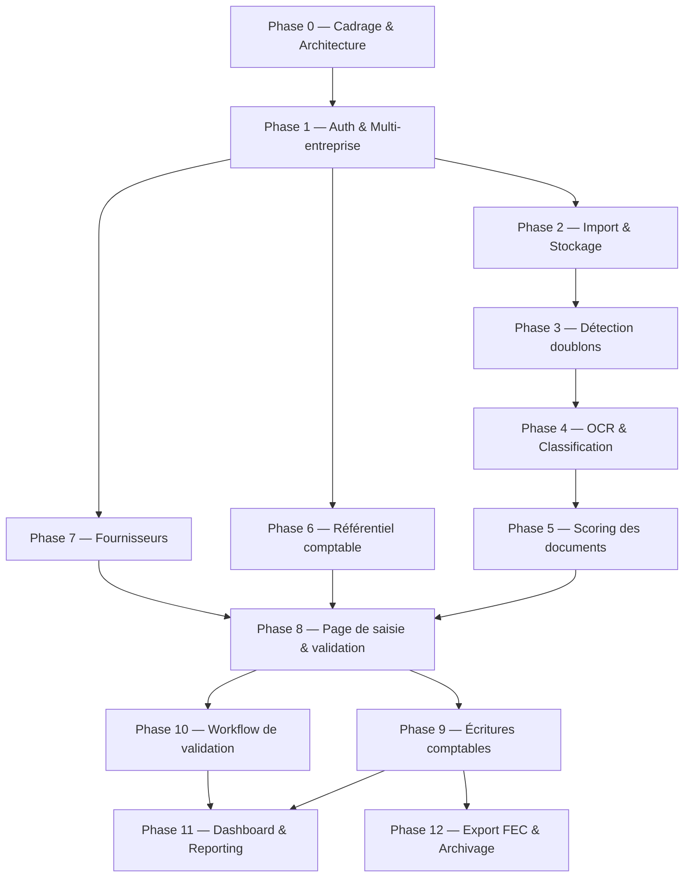

# 🔗 MCA — Enchaînement des Phases (v1)

## Séquence logique

```
0. Cadrage & Architecture
        │
        ▼
1. Authentification & Multi-entreprise
        │
        ├──────────────┬───────────────┐
        ▼              ▼               ▼
2. Import & Stockage   6. Référentiel   7. Fournisseurs
        │              comptable            │
        ▼                   │                │
3. Détection doublons        │                │
        │                   │                │
        ▼                   │                │
4. OCR & Classification      │                │
        │                   │                │
        ▼                   │                │
5. Scoring des documents     │                │
        │                   │                │
        └─────────┬─────────┴────────────────┘
                   ▼
        8. Page de saisie & validation
                   │
        ┌──────────┴──────────┐
        ▼                     ▼
9. Écritures comptables   10. Workflow de validation
        │                     │
        └──────────┬──────────┘
                    ▼
        ┌───────────┴───────────┐
        ▼                       ▼
11. Dashboard & Reporting   12. Export FEC & Archivage
```

## Diagramme Mermaid



## Ce qui peut être fait en parallèle

| Bloc | Phases en parallèle | Condition |
|---|---|---|
| Après l'Auth | **Phase 2** (Import), **Phase 6** (Référentiel comptable), **Phase 7** (Fournisseurs) | Ces trois phases ne dépendent pas les unes des autres, seulement de la Phase 1. |
| Traitement documentaire | **Phase 3 → 4 → 5** doit rester séquentiel | Chaque étape a besoin du résultat de la précédente (hash → OCR → score). |
| Avant la saisie | **Phase 6** et **Phase 7** peuvent avancer pendant tout le bloc 2-3-4-5 | Le référentiel comptable et les fournisseurs sont indépendants du pipeline OCR. |
| Après la saisie | **Phase 9** (Écritures) et **Phase 10** (Workflow) | Peuvent démarrer en parallèle une fois la Phase 8 stabilisée. |
| Fin de projet | **Phase 11** (Dashboard) et **Phase 12** (Export FEC) | Le Dashboard peut même démarrer avec des données de test pendant la Phase 9. |

## Suggestion de répartition Princi / Mahery sur les blocs parallèles

- **Bloc A (Import → Doublons → OCR → Scoring)** : porté principalement par **Mahery**, avec Princi sur les tâches de détection de doublons et de stockage des résultats OCR.
- **Bloc B (Référentiel comptable + Fournisseurs)** : porté principalement par **Princi**, avec Mahery sur les fiches fournisseurs et le matching automatique.
- Les deux blocs convergent vers la **Phase 8 (Saisie)**, qui doit donc être développée par celui des deux qui termine son bloc en premier, ou en binôme si le calendrier le permet.
