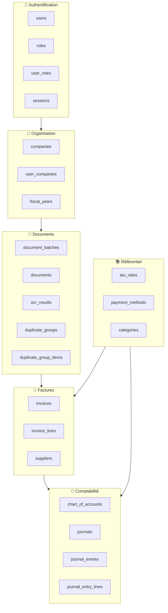
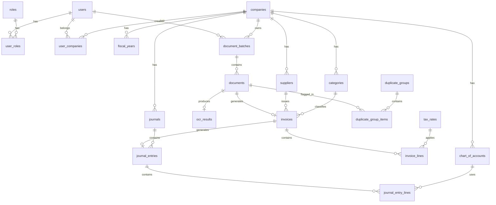
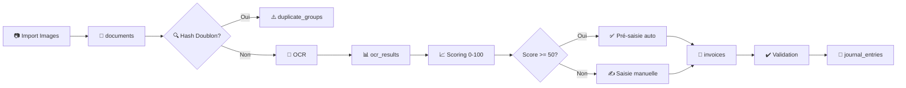

# 📊 Schéma de Base de Données — Module Pré-Comptabilité (MCA)

> [!NOTE]
> Base de données conçue pour être **flexible**, **multi-entreprise**, et **extensible**. Inspirée de systèmes comme Pennylane.

---

## 🏗️ Architecture Générale



---

## 📐 Diagramme Entité-Relation



---

## 🔐 Module 1 : Authentification & Utilisateurs

### `users`
| Colonne | Type | Contrainte | Description |
|---------|------|------------|-------------|
| id | UUID | PK | Identifiant unique |
| email | VARCHAR(255) | UNIQUE, NOT NULL | Email de connexion |
| password_hash | VARCHAR(255) | NOT NULL | Mot de passe hashé (bcrypt) |
| first_name | VARCHAR(100) | NOT NULL | Prénom |
| last_name | VARCHAR(100) | NOT NULL | Nom |
| avatar_url | TEXT | NULL | Photo de profil |
| is_active | BOOLEAN | DEFAULT true | Compte actif |
| email_verified_at | TIMESTAMP | NULL | Date vérification email |
| last_login_at | TIMESTAMP | NULL | Dernière connexion |
| created_at | TIMESTAMP | DEFAULT NOW() | Création |
| updated_at | TIMESTAMP | DEFAULT NOW() | Mise à jour |

### `roles`
| Colonne | Type | Contrainte | Description |
|---------|------|------------|-------------|
| id | UUID | PK | Identifiant |
| name | VARCHAR(50) | UNIQUE | Nom du rôle |
| description | TEXT | NULL | Description |
| permissions | JSONB | DEFAULT '{}' | Permissions détaillées |

> [!TIP]
> Rôles suggérés : `admin`, `comptable`, `operateur_saisie`, `auditeur`, `viewer`

### `user_roles`
| Colonne | Type | Contrainte | Description |
|---------|------|------------|-------------|
| user_id | UUID | FK → users | Utilisateur |
| role_id | UUID | FK → roles | Rôle |
| company_id | UUID | FK → companies | Rôle par entreprise |

### `sessions`
| Colonne | Type | Contrainte | Description |
|---------|------|------------|-------------|
| id | UUID | PK | Identifiant |
| user_id | UUID | FK → users | Utilisateur |
| token | VARCHAR(500) | UNIQUE | JWT / token de session |
| refresh_token | VARCHAR(500) | UNIQUE | Token de rafraîchissement |
| ip_address | VARCHAR(45) | NULL | IP de connexion |
| user_agent | TEXT | NULL | Navigateur |
| expires_at | TIMESTAMP | NOT NULL | Expiration |
| created_at | TIMESTAMP | DEFAULT NOW() | Création |

### `audit_logs`
| Colonne | Type | Contrainte | Description |
|---------|------|------------|-------------|
| id | UUID | PK | Identifiant |
| user_id | UUID | FK → users | Qui |
| company_id | UUID | FK → companies | Entreprise |
| action | VARCHAR(50) | NOT NULL | Action (CREATE, UPDATE, DELETE) |
| entity_type | VARCHAR(100) | NOT NULL | Table concernée |
| entity_id | UUID | NOT NULL | ID de l'entité |
| old_values | JSONB | NULL | Anciennes valeurs |
| new_values | JSONB | NULL | Nouvelles valeurs |
| ip_address | VARCHAR(45) | NULL | IP |
| created_at | TIMESTAMP | DEFAULT NOW() | Date |

---

## 🏢 Module 2 : Organisation Multi-Entreprise

### `companies`
| Colonne | Type | Contrainte | Description |
|---------|------|------------|-------------|
| id | UUID | PK | Identifiant |
| name | VARCHAR(255) | NOT NULL | Raison sociale |
| siren | VARCHAR(20) | NULL | N° SIREN |
| siret | VARCHAR(20) | NULL | N° SIRET |
| nif | VARCHAR(50) | NULL | NIF (Madagascar) |
| stat | VARCHAR(50) | NULL | N° STAT (Madagascar) |
| address | TEXT | NULL | Adresse |
| city | VARCHAR(100) | NULL | Ville |
| postal_code | VARCHAR(20) | NULL | Code postal |
| country | VARCHAR(2) | DEFAULT 'MG' | Code pays ISO |
| currency | VARCHAR(3) | DEFAULT 'MGA' | Devise |
| logo_url | TEXT | NULL | Logo |
| settings | JSONB | DEFAULT '{}' | Paramètres personnalisés |
| is_active | BOOLEAN | DEFAULT true | Active |
| created_at | TIMESTAMP | DEFAULT NOW() | Création |

### `user_companies`
| Colonne | Type | Contrainte | Description |
|---------|------|------------|-------------|
| user_id | UUID | FK → users | Utilisateur |
| company_id | UUID | FK → companies | Entreprise |
| is_default | BOOLEAN | DEFAULT false | Entreprise par défaut |

### `fiscal_years`
| Colonne | Type | Contrainte | Description |
|---------|------|------------|-------------|
| id | UUID | PK | Identifiant |
| company_id | UUID | FK → companies | Entreprise |
| label | VARCHAR(50) | NOT NULL | Ex: "2026" |
| start_date | DATE | NOT NULL | Début exercice |
| end_date | DATE | NOT NULL | Fin exercice |
| is_closed | BOOLEAN | DEFAULT false | Clôturé |
| closed_at | TIMESTAMP | NULL | Date clôture |
| closed_by | UUID | FK → users | Clôturé par |

---

## 📄 Module 3 : Import & Documents

### `document_batches`
| Colonne | Type | Contrainte | Description |
|---------|------|------------|-------------|
| id | UUID | PK | Identifiant |
| company_id | UUID | FK → companies | Entreprise |
| uploaded_by | UUID | FK → users | Importé par |
| label | VARCHAR(255) | NULL | Libellé du lot |
| source | VARCHAR(50) | NOT NULL | Source (upload, email, api, scan) |
| total_documents | INT | DEFAULT 0 | Nombre total |
| processed_count | INT | DEFAULT 0 | Nombre traités |
| failed_count | INT | DEFAULT 0 | Nombre en erreur |
| status | VARCHAR(20) | DEFAULT 'pending' | pending, processing, completed, failed |
| created_at | TIMESTAMP | DEFAULT NOW() | Création |

### `documents`
| Colonne | Type | Contrainte | Description |
|---------|------|------------|-------------|
| id | UUID | PK | Identifiant |
| batch_id | UUID | FK → document_batches | Lot d'import |
| company_id | UUID | FK → companies | Entreprise |
| file_name | VARCHAR(500) | NOT NULL | Nom du fichier original |
| file_path | TEXT | NOT NULL | Chemin stockage |
| file_size | BIGINT | NOT NULL | Taille en octets |
| mime_type | VARCHAR(100) | NOT NULL | Type MIME |
| file_hash | VARCHAR(128) | NOT NULL | Hash SHA-256 (doublons) |
| page_count | INT | DEFAULT 1 | Nombre de pages |
| status | VARCHAR(20) | DEFAULT 'uploaded' | uploaded, ocr_pending, ocr_done, processed, error |
| processing_score | DECIMAL(5,2) | DEFAULT 0 | Score 0-100 |
| score_details | JSONB | DEFAULT '{}' | Détail du scoring par champ |
| error_message | TEXT | NULL | Message d'erreur |
| metadata | JSONB | DEFAULT '{}' | Métadonnées flexibles |
| created_at | TIMESTAMP | DEFAULT NOW() | Création |
| updated_at | TIMESTAMP | DEFAULT NOW() | Mise à jour |

> [!IMPORTANT]
> Le `file_hash` est essentiel pour la **détection de doublons**. Calculé en SHA-256 sur le contenu du fichier.

### `ocr_results`
| Colonne | Type | Contrainte | Description |
|---------|------|------------|-------------|
| id | UUID | PK | Identifiant |
| document_id | UUID | FK → documents, UNIQUE | Document source |
| raw_text | TEXT | NULL | Texte brut extrait |
| structured_data | JSONB | NULL | Données structurées extraites |
| detected_type | VARCHAR(50) | NULL | invoice, credit_note, receipt, other |
| confidence_score | DECIMAL(5,2) | NULL | Confiance globale OCR |
| field_scores | JSONB | DEFAULT '{}' | Confiance par champ |
| provider | VARCHAR(50) | NULL | google_vision, tesseract, azure, custom |
| processing_time_ms | INT | NULL | Durée traitement |
| created_at | TIMESTAMP | DEFAULT NOW() | Création |

> [!TIP]
> `structured_data` exemple :
> ```json
> {
>   "supplier_name": "SARL Example",
>   "invoice_number": "FAC-2026-001",
>   "date": "2026-08-15",
>   "total_ht": 150000,
>   "total_ttc": 180000,
>   "tva": 30000,
>   "line_items": [...]
> }
> ```

### `duplicate_groups`
| Colonne | Type | Contrainte | Description |
|---------|------|------------|-------------|
| id | UUID | PK | Identifiant |
| company_id | UUID | FK → companies | Entreprise |
| match_type | VARCHAR(50) | NOT NULL | hash, invoice_number, amount_date, fuzzy |
| match_score | DECIMAL(5,2) | NULL | Score de similarité |
| status | VARCHAR(20) | DEFAULT 'pending' | pending, confirmed, dismissed |
| resolved_by | UUID | FK → users | Résolu par |
| resolved_at | TIMESTAMP | NULL | Date résolution |
| created_at | TIMESTAMP | DEFAULT NOW() | Création |

### `duplicate_group_items`
| Colonne | Type | Contrainte | Description |
|---------|------|------------|-------------|
| id | UUID | PK | Identifiant |
| group_id | UUID | FK → duplicate_groups | Groupe |
| document_id | UUID | FK → documents | Document |
| is_original | BOOLEAN | DEFAULT false | Marqué comme original |

---

## 🧾 Module 4 : Factures & Fournisseurs

### `suppliers`
| Colonne | Type | Contrainte | Description |
|---------|------|------------|-------------|
| id | UUID | PK | Identifiant |
| company_id | UUID | FK → companies | Entreprise |
| name | VARCHAR(255) | NOT NULL | Raison sociale |
| code | VARCHAR(50) | NULL | Code fournisseur |
| nif | VARCHAR(50) | NULL | NIF |
| stat | VARCHAR(50) | NULL | N° STAT |
| email | VARCHAR(255) | NULL | Email |
| phone | VARCHAR(50) | NULL | Téléphone |
| address | TEXT | NULL | Adresse |
| default_account_id | UUID | FK → chart_of_accounts | Compte par défaut |
| default_journal_id | UUID | FK → journals | Journal par défaut |
| payment_terms_days | INT | DEFAULT 30 | Délai de paiement |
| metadata | JSONB | DEFAULT '{}' | Données flexibles |
| is_active | BOOLEAN | DEFAULT true | Actif |
| created_at | TIMESTAMP | DEFAULT NOW() | Création |

### `invoices`
| Colonne | Type | Contrainte | Description |
|---------|------|------------|-------------|
| id | UUID | PK | Identifiant |
| company_id | UUID | FK → companies | Entreprise |
| document_id | UUID | FK → documents | Document source |
| supplier_id | UUID | FK → suppliers | Fournisseur |
| category_id | UUID | FK → categories | Catégorie |
| fiscal_year_id | UUID | FK → fiscal_years | Exercice |
| invoice_number | VARCHAR(100) | NULL | N° facture |
| invoice_type | VARCHAR(20) | NOT NULL | invoice, credit_note, receipt |
| direction | VARCHAR(10) | NOT NULL | inbound (achat), outbound (vente) |
| invoice_date | DATE | NULL | Date facture |
| due_date | DATE | NULL | Date d'échéance |
| currency | VARCHAR(3) | DEFAULT 'MGA' | Devise |
| subtotal | DECIMAL(15,2) | DEFAULT 0 | Total HT |
| tax_amount | DECIMAL(15,2) | DEFAULT 0 | Total TVA |
| total | DECIMAL(15,2) | DEFAULT 0 | Total TTC |
| payment_status | VARCHAR(20) | DEFAULT 'unpaid' | unpaid, partial, paid |
| status | VARCHAR(20) | DEFAULT 'draft' | draft, to_review, validated, accounted, rejected |
| processing_score | DECIMAL(5,2) | DEFAULT 0 | Score hérité du document |
| validated_by | UUID | FK → users | Validé par |
| validated_at | TIMESTAMP | NULL | Date validation |
| notes | TEXT | NULL | Remarques |
| ocr_corrections | JSONB | DEFAULT '{}' | Corrections manuelles vs OCR |
| created_by | UUID | FK → users | Créé par |
| created_at | TIMESTAMP | DEFAULT NOW() | Création |
| updated_at | TIMESTAMP | DEFAULT NOW() | Mise à jour |

### `invoice_lines`
| Colonne | Type | Contrainte | Description |
|---------|------|------------|-------------|
| id | UUID | PK | Identifiant |
| invoice_id | UUID | FK → invoices | Facture |
| line_number | INT | NOT NULL | Ordre de la ligne |
| description | TEXT | NULL | Description |
| account_id | UUID | FK → chart_of_accounts | Compte comptable |
| quantity | DECIMAL(10,3) | DEFAULT 1 | Quantité |
| unit_price | DECIMAL(15,2) | DEFAULT 0 | Prix unitaire HT |
| amount_ht | DECIMAL(15,2) | DEFAULT 0 | Montant HT |
| tax_rate_id | UUID | FK → tax_rates | Taux TVA |
| tax_amount | DECIMAL(15,2) | DEFAULT 0 | Montant TVA |
| amount_ttc | DECIMAL(15,2) | DEFAULT 0 | Montant TTC |

---

## 📒 Module 5 : Comptabilité

### `chart_of_accounts` (Plan Comptable)
| Colonne | Type | Contrainte | Description |
|---------|------|------------|-------------|
| id | UUID | PK | Identifiant |
| company_id | UUID | FK → companies | Entreprise |
| parent_id | UUID | FK → self | Compte parent |
| account_number | VARCHAR(20) | NOT NULL | N° de compte (ex: 601000) |
| label | VARCHAR(255) | NOT NULL | Libellé |
| account_type | VARCHAR(20) | NOT NULL | asset, liability, equity, revenue, expense |
| is_leaf | BOOLEAN | DEFAULT true | Compte imputable |
| is_active | BOOLEAN | DEFAULT true | Actif |

### `journals`
| Colonne | Type | Contrainte | Description |
|---------|------|------------|-------------|
| id | UUID | PK | Identifiant |
| company_id | UUID | FK → companies | Entreprise |
| code | VARCHAR(10) | NOT NULL | Code (AC, VE, BQ, OD) |
| label | VARCHAR(100) | NOT NULL | Libellé |
| journal_type | VARCHAR(20) | NOT NULL | purchase, sale, bank, misc |
| default_account_id | UUID | FK → chart_of_accounts | Compte par défaut |
| is_active | BOOLEAN | DEFAULT true | Actif |

### `journal_entries` (Écritures)
| Colonne | Type | Contrainte | Description |
|---------|------|------------|-------------|
| id | UUID | PK | Identifiant |
| company_id | UUID | FK → companies | Entreprise |
| journal_id | UUID | FK → journals | Journal |
| fiscal_year_id | UUID | FK → fiscal_years | Exercice |
| invoice_id | UUID | FK → invoices | Facture source |
| entry_number | VARCHAR(50) | NOT NULL | N° écriture (auto) |
| entry_date | DATE | NOT NULL | Date écriture |
| label | VARCHAR(255) | NOT NULL | Libellé |
| reference | VARCHAR(100) | NULL | Référence (n° facture) |
| status | VARCHAR(20) | DEFAULT 'draft' | draft, posted, reversed |
| is_balanced | BOOLEAN | DEFAULT true | Équilibrée |
| posted_by | UUID | FK → users | Comptabilisé par |
| posted_at | TIMESTAMP | NULL | Date comptabilisation |
| created_by | UUID | FK → users | Créé par |
| created_at | TIMESTAMP | DEFAULT NOW() | Création |

### `journal_entry_lines` (Lignes d'écritures)
| Colonne | Type | Contrainte | Description |
|---------|------|------------|-------------|
| id | UUID | PK | Identifiant |
| entry_id | UUID | FK → journal_entries | Écriture |
| account_id | UUID | FK → chart_of_accounts | Compte |
| label | VARCHAR(255) | NULL | Libellé ligne |
| debit | DECIMAL(15,2) | DEFAULT 0 | Débit |
| credit | DECIMAL(15,2) | DEFAULT 0 | Crédit |
| tax_rate_id | UUID | FK → tax_rates | TVA associée |
| line_number | INT | NOT NULL | Ordre |

---

## 📚 Module 6 : Référentiel

### `tax_rates`
| Colonne | Type | Contrainte | Description |
|---------|------|------------|-------------|
| id | UUID | PK | Identifiant |
| company_id | UUID | FK → companies | Entreprise |
| code | VARCHAR(20) | NOT NULL | Code (TVA20, TVA0) |
| label | VARCHAR(100) | NOT NULL | Libellé |
| rate | DECIMAL(5,2) | NOT NULL | Taux (ex: 20.00) |
| account_id | UUID | FK → chart_of_accounts | Compte de TVA |
| is_active | BOOLEAN | DEFAULT true | Actif |

### `categories`
| Colonne | Type | Contrainte | Description |
|---------|------|------------|-------------|
| id | UUID | PK | Identifiant |
| company_id | UUID | FK → companies | Entreprise |
| parent_id | UUID | FK → self | Catégorie parente |
| name | VARCHAR(100) | NOT NULL | Nom |
| code | VARCHAR(20) | NULL | Code |
| default_account_id | UUID | FK → chart_of_accounts | Compte par défaut |
| is_active | BOOLEAN | DEFAULT true | Actif |

### `payment_methods`
| Colonne | Type | Contrainte | Description |
|---------|------|------------|-------------|
| id | UUID | PK | Identifiant |
| company_id | UUID | FK → companies | Entreprise |
| name | VARCHAR(100) | NOT NULL | Nom (Virement, Chèque, Espèces, Mobile Money) |
| code | VARCHAR(20) | NOT NULL | Code |
| is_active | BOOLEAN | DEFAULT true | Actif |

---

## 🔑 Index Recommandés

```sql
-- Performance : recherche de doublons
CREATE INDEX idx_documents_file_hash ON documents(file_hash);
CREATE INDEX idx_documents_company_status ON documents(company_id, status);
CREATE INDEX idx_documents_score ON documents(processing_score);

-- Performance : factures
CREATE INDEX idx_invoices_company_status ON invoices(company_id, status);
CREATE INDEX idx_invoices_supplier ON invoices(supplier_id);
CREATE INDEX idx_invoices_date ON invoices(invoice_date);
CREATE INDEX idx_invoices_number ON invoices(company_id, invoice_number);

-- Performance : écritures
CREATE INDEX idx_journal_entries_date ON journal_entries(entry_date);
CREATE INDEX idx_journal_entries_journal ON journal_entries(journal_id);
CREATE INDEX idx_journal_entry_lines_account ON journal_entry_lines(account_id);

-- Performance : plan comptable
CREATE INDEX idx_coa_number ON chart_of_accounts(company_id, account_number);

-- Performance : audit
CREATE INDEX idx_audit_logs_entity ON audit_logs(entity_type, entity_id);
CREATE INDEX idx_audit_logs_user ON audit_logs(user_id);
```

---

## 🔄 Flux de Données


